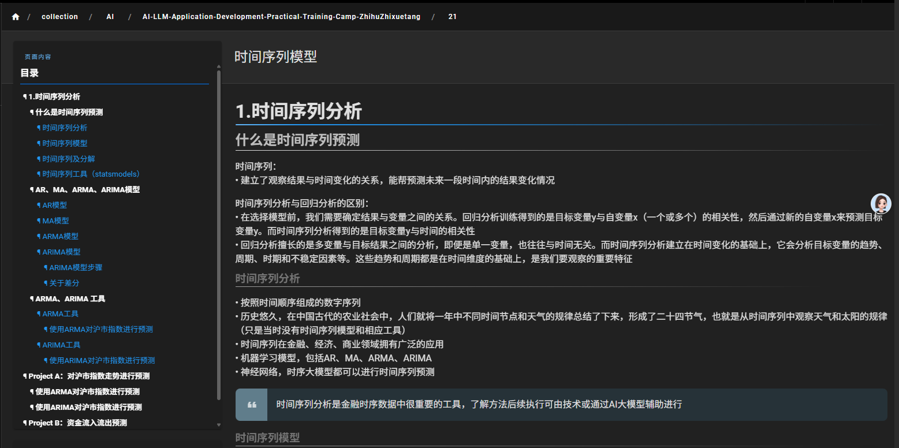

# Wiki.js 多级目录生成器

一个专为 Wiki.js 设计的 JavaScript 脚本，用于解决 Wiki.js 原生目录只能显示两级的问题，自动生成完整的多级目录树。



## 🚀 功能特性

- **多级目录支持**：自动扫描页面中的所有标题（h1-h6），生成完整的多级目录
- **智能锚点处理**：优先使用 Wiki.js 已有的锚点ID，确保链接正确
- **平滑滚动**：点击目录项时平滑滚动到对应标题位置
- **滚动高亮**：页面滚动时自动高亮当前可见的目录项
- **tabset 排除**：自动排除 `.tabset` 元素内部的标题，避免在标签页内容中生成目录项
- **深色主题适配**：完美适配 Wiki.js 深色主题，提供美观的视觉效果
- **响应式设计**：支持桌面端和移动端，自适应不同屏幕尺寸
- **自定义滚动条**：美观的自定义滚动条样式，与深色背景协调
- **API 接口**：提供完整的 JavaScript API，支持外部调用和控制

## 📋 系统要求

- Wiki.js 2.x 或更高版本
- 现代浏览器（Chrome、Firefox、Safari、Edge）
- 支持 JavaScript 的浏览器环境

## 🛠️ 安装方法

- 开发环境使用 `wiki-toc-simple.js`（带注释，便于调试）
- 生产环境使用 `wiki-toc-simple.min.js`（体积小，加载快）

``` html
<!-- 开发版本 -->
<script src="wiki-toc-simple.js"></script>

<!-- 生产版本 -->
<script src="wiki-toc-simple.min.js"></script>
```

### 方法一：直接引入脚本

1. 下载 `wiki-toc-simple.js` 文件
2. 将文件上传到 Wiki.js 的静态资源目录
3. 在 Wiki.js 管理后台的"外观" → "自定义 CSS/JS" 中添加：

```html
<script src="/path/to/wiki-toc-simple.js"></script>
```

### 方法二：内联脚本

在 Wiki.js 管理后台的"外观" → "自定义 CSS/JS" 中直接粘贴脚本内容：

```html
<script>
// 将 wiki-toc-simple.js 的完整内容粘贴在这里
</script>
```

### 方法三：浏览器控制台

在浏览器开发者工具的控制台中直接运行脚本内容（临时使用）。

## 🎯 使用方法

### 自动运行

脚本会在页面加载完成后自动运行，无需手动干预。

### 手动控制

通过浏览器控制台或自定义脚本调用 API：

```javascript
// 重新生成目录
wikiTOCSimple.refresh();

// 移除目录
wikiTOCSimple.remove();

// 修改配置
wikiTOCSimple.config.tocTitle = '页面导航';
wikiTOCSimple.config.scrollOffset = 100;

// 查看配置
console.log(wikiTOCSimple.config);
```

## ⚙️ 配置选项

脚本提供了灵活的配置选项，可以根据需要调整：

```javascript
const config = {
    // 文章内容选择器 - 用于查找包含标题的内容区域
    contentSelector: '.contents, [class*="contents"], main .contents',
    
    // 原始目录容器选择器 - 用于定位Wiki.js的原生目录
    tocSelector: '.v-list--nav, [class*="v-list--nav"], .page-col-sd .v-list',
    
    // 目录标题文本
    tocTitle: '目录',
    
    // 滚动偏移量 - 点击目录链接时，目标位置距离顶部的距离
    scrollOffset: 80
};
```

### 配置说明

- **contentSelector**: 指定包含文章标题的容器元素，支持多个备选选择器
- **tocSelector**: 指定 Wiki.js 原生目录的容器元素，脚本会隐藏它并插入自定义目录
- **tocTitle**: 自定义目录的标题文本
- **scrollOffset**: 滚动偏移量，用于避免标题被固定导航栏遮挡

## 🎨 样式定制

脚本使用 CSS 类名进行样式控制，可以通过自定义 CSS 进行样式调整：

### 主要 CSS 类

- `.wiki-toc-simple`: 目录容器
- `.wiki-toc-title`: 目录标题
- `.wiki-toc-list`: 目录列表
- `.wiki-toc-item`: 目录项
- `.wiki-toc-link`: 目录链接

### 样式定制示例

```css
/* 修改目录标题颜色 */
.wiki-toc-title {
    color: #ff6b6b !important;
}

/* 修改一级目录样式 */
.wiki-toc-item[data-level="1"] .wiki-toc-link {
    font-size: 16px !important;
    color: #4ecdc4 !important;
}

/* 修改悬停效果 */
.wiki-toc-link:hover {
    background-color: rgba(255, 107, 107, 0.2) !important;
}
```

## 🔧 高级用法

### 动态内容处理

如果页面内容是通过 AJAX 动态加载的，可以在内容加载完成后手动刷新目录：

```javascript
// 假设内容加载完成
contentLoaded().then(() => {
    wikiTOCSimple.refresh();
});
```

### 主题切换适配

如果 Wiki.js 支持主题切换，可以在主题切换后重新生成目录：

```javascript
// 监听主题切换事件
document.addEventListener('themeChanged', () => {
    wikiTOCSimple.refresh();
});
```

### 自定义标题过滤

可以通过修改脚本中的标题选择器来过滤特定标题：

```javascript
// 只包含 h1, h2, h3 标题
const headings = content.querySelectorAll('h1, h2, h3');
```

### tabset 排除功能

脚本会自动排除 `.tabset` 元素内部的标题，避免在标签页内容中生成目录项。这是通过以下逻辑实现的：

```javascript
// 检查标题是否在 .tabset 元素内部
const isInTabset = heading.closest('.tabset');
return !isInTabset; // 返回不在 .tabset 内的标题
```

如果您需要排除其他类型的容器，可以修改脚本中的过滤逻辑。

## 🐛 故障排除

### 常见问题

1. **目录未显示**
   - 检查 `contentSelector` 配置是否正确
   - 确认页面中有标题元素（h1-h6）
   - 查看浏览器控制台是否有错误信息

2. **链接跳转错误**
   - 检查 `tocSelector` 配置是否正确
   - 确认 Wiki.js 版本兼容性
   - 验证锚点ID是否正确生成

3. **样式显示异常**
   - 检查是否有其他 CSS 样式冲突
   - 确认浏览器支持程度
   - 尝试清除浏览器缓存

### 调试方法

1. 打开浏览器开发者工具
2. 查看控制台输出信息
3. 检查网络请求是否正常
4. 验证 DOM 元素是否正确生成

## 📝 更新日志

### v1.0.2 (2025-07-19)
- ✨ **新增 tabset 排除功能**：自动排除 `.tabset` 元素内部的标题，避免在标签页内容中生成目录项
- 🔧 **优化标题过滤逻辑**：改进标题选择器，提高目录生成的准确性
- 📚 **更新文档**：完善功能说明和使用指南

### v1.0.1 (2025-07-16)
- ✨ **新增滚动高亮功能**：正文滑动时自动高亮对应的目录项
- ✨ **新增目录自动滚动**：高亮目录项不在可视区域时自动滚动定位
- ✨ **新增代码压缩版本**：提供 `wiki-toc-simple.min.js` 压缩文件
- 🎨 **优化滚动条样式**：自定义滚动条样式，与深色背景更协调
- 🎨 **优化目录布局**：减少左边留白，改善一级目录悬浮效果
- 🔧 **简化选择器**：优化元素选择器，提高兼容性和可维护性
- 📚 **完善文档注释**：添加详细的中文注释和 API 文档
- 🔧 **性能优化**：使用节流机制优化滚动事件处理

### v1.0.0 (2025-07-16)
- 初始版本发布
- 支持多级目录生成
- 智能锚点处理
- 深色主题适配
- 响应式设计
- API 接口支持

## 🤝 贡献指南

欢迎提交 Issue 和 Pull Request 来改进这个项目。

### 开发环境

1. Fork 项目
2. 创建功能分支
3. 提交更改
4. 推送到分支
5. 创建 Pull Request

## 📄 许可证

本项目采用 MIT 许可证，详见 [LICENSE](LICENSE) 文件。

## 🙏 致谢

感谢 [Wiki.js](https://github.com/requarks/wiki) 团队提供的优秀平台，以及所有为这个项目做出贡献的开发者。

---

**注意**: 此脚本为第三方开发，与 Wiki.js 官方无关。使用前请备份重要数据。 